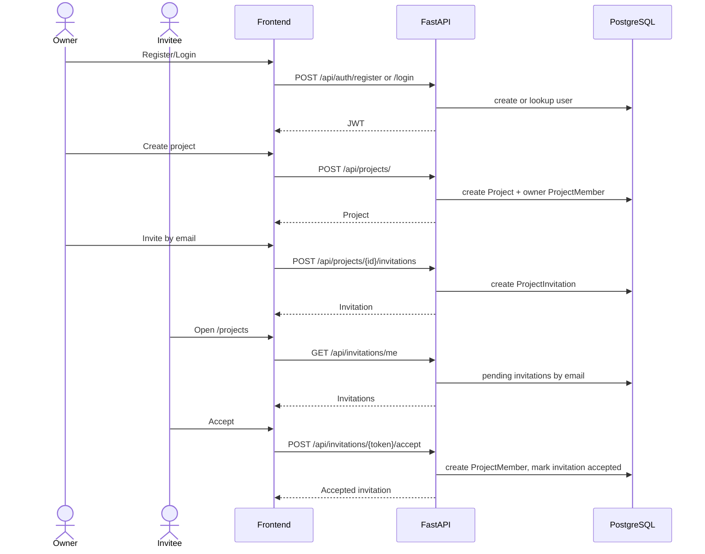

# API

Base path は `/api` です。認証が必要なAPIは `Authorization: Bearer <token>` を使います。

## Auth

| Method | Path | Auth | Summary |
| --- | --- | --- | --- |
| POST | `/api/auth/register` | No | ユーザー登録。JWTとユーザー情報を返す |
| POST | `/api/auth/login` | No | ログイン。JWTとユーザー情報を返す |
| GET | `/api/auth/me` | Yes | ログイン中ユーザーを返す |
| DELETE | `/api/auth/me` | Yes | 退会。確認用メールアドレス必須 |

## Projects

| Method | Path | Auth | Summary |
| --- | --- | --- | --- |
| GET | `/api/projects/` | Yes | 自分が所属するプロジェクト一覧 |
| POST | `/api/projects/` | Yes | プロジェクト作成。作成者は owner になる |
| GET | `/api/projects/{project_id}` | Yes | 所属しているプロジェクト詳細 |
| PATCH | `/api/projects/{project_id}` | Yes | owner/admin がプロジェクト更新 |
| DELETE | `/api/projects/{project_id}` | Yes | owner がプロジェクト削除 |
| POST | `/api/projects/{project_id}/members` | Yes | owner/admin がメンバーを直接追加 |
| DELETE | `/api/projects/{project_id}/members/{member_id}` | Yes | owner/admin がメンバー削除 |

## Invitations

| Method | Path | Auth | Summary |
| --- | --- | --- | --- |
| POST | `/api/projects/{project_id}/invitations` | Yes | owner/admin がメールアドレスで招待 |
| GET | `/api/projects/{project_id}/invitations` | Yes | owner/admin が招待一覧を取得 |
| DELETE | `/api/projects/{project_id}/invitations/{invitation_id}` | Yes | owner/admin が pending 招待を取消 |
| GET | `/api/invitations/me` | Yes | 自分のメールアドレス宛の pending 招待一覧 |
| GET | `/api/invitations/{token}` | No | 招待プレビュー |
| POST | `/api/invitations/{token}/accept` | Yes | 招待承認。メールアドレス一致が必要 |

## Tasks

すべての Task API はプロジェクトメンバーシップを確認します。非ログインは 401、非メンバーは 404 を返します。

| Method | Path | Auth | Summary |
| --- | --- | --- | --- |
| GET | `/api/tasks/project/{project_id}` | Yes | プロジェクトのルートタスク一覧（メンバーのみ） |
| POST | `/api/tasks/project/{project_id}` | Yes | プロジェクトタスク作成（メンバーのみ） |
| GET | `/api/tasks/{task_id}` | Yes | タスク取得（所属プロジェクトのメンバーのみ） |
| PATCH | `/api/tasks/{task_id}` | Yes | タスク更新（所属プロジェクトのメンバーのみ） |
| DELETE | `/api/tasks/{task_id}` | Yes | タスク削除（所属プロジェクトのメンバーのみ） |

## Personal Tasks

| Method | Path | Auth | Summary |
| --- | --- | --- | --- |
| GET | `/api/personal-tasks/` | Yes | 自分の個人タスク一覧 |
| POST | `/api/personal-tasks/` | Yes | 個人タスク作成 |
| PATCH | `/api/personal-tasks/{task_id}` | Yes | 自分の個人タスク更新 |
| DELETE | `/api/personal-tasks/{task_id}` | Yes | 自分の個人タスク削除 |

## Main Flow

