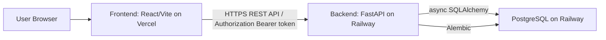
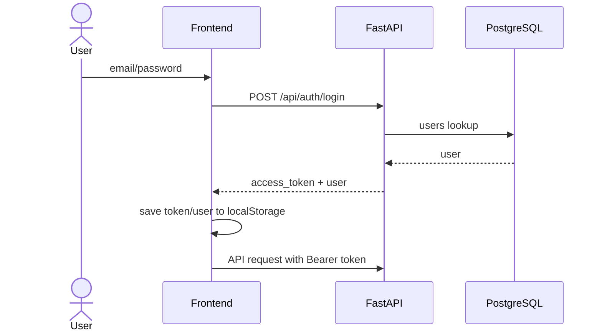

# Architecture

## System Overview

TodoTree は React + Vite の SPA、FastAPI の REST API、PostgreSQL で構成されています。

## Responsibilities

### Frontend

- React Router による画面遷移
- 認証トークンを `localStorage` に保存
- Axios interceptor で `Authorization: Bearer <token>` を付与
- `VITE_API_BASE_URL` を使ってBackendへ通信
- Vercel では `frontend/vercel.json` により全パスを `index.html` に rewrite

### Backend

- FastAPI による REST API
- JWT発行、認証ユーザー取得
- プロジェクト、タスク、個人タスク、招待のCRUD
- SQLAlchemy async session によるDBアクセス
- `/api/health` によるヘルスチェック
- `/api/` レスポンスに `Cache-Control: no-store` を付与

### Database

- PostgreSQL
- Alembic migration で schema を管理
- 本番では起動時の `create_all` を使わない

### Deploy

- Frontend: Vercel
- Backend: Railway
- Database: Railway PostgreSQL

## Authentication

## CORS

Backend は `FRONTEND_ORIGIN` を `allow_origins` に設定します。credentials は許可されています。

## Environment Variables

Backend:

- `DATABASE_URL`
- `SECRET_KEY`
- `FRONTEND_ORIGIN`
- `APP_ENV`
- `SQL_ECHO`
- `CREATE_TABLES_ON_STARTUP`

Frontend:

- `VITE_API_BASE_URL`

本番では `SECRET_KEY`, `DATABASE_URL`, `FRONTEND_ORIGIN` が production 用に設定されていない場合、Backend は起動しません。
