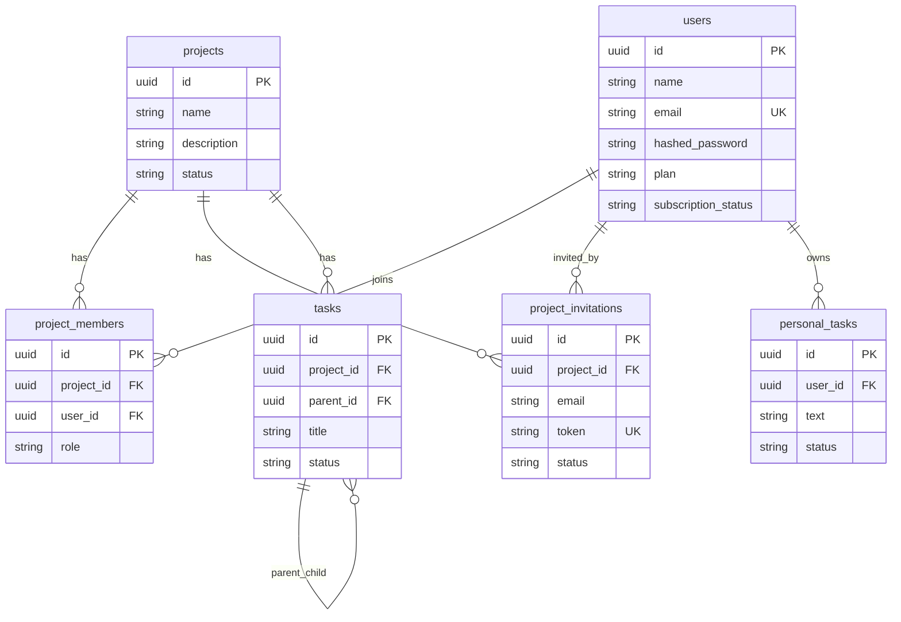

# Database

DB設計は SQLAlchemy models と Alembic migrations に基づきます。

## Tables

| Table | Model | Summary |
| --- | --- | --- |
| `users` | `User` | 認証ユーザー、プラン関連情報 |
| `projects` | `Project` | プロジェクト |
| `project_members` | `ProjectMember` | プロジェクト所属とロール |
| `project_invitations` | `ProjectInvitation` | メール招待 |
| `tasks` | `Task` | プロジェクトタスク、自己参照ツリー |
| `personal_tasks` | `PersonalTask` | ユーザー個人タスク |

## ER Diagram



## Constraints and Indexes

確認できる制約:

- `users.email` は unique index
- `users.stripe_customer_id` は unique index
- `users.stripe_subscription_id` は unique index
- `project_members` は `(project_id, user_id)` に unique constraint
- `project_members.project_id` と `project_members.user_id` は index
- `project_invitations.token` は unique index
- `project_invitations.project_id`, `email`, `invited_by_user_id` は index
- `project_invitations` は pending の `(project_id, email)` に partial unique index
- `tasks.parent_id` は index
- `personal_tasks.user_id` は index

## Delete Behavior

コードとモデルから確認できる動作:

- Project削除で tasks / project_members / project_invitations は cascade
- User削除時の退会APIは、個人タスク、所属、関連招待を明示的に削除
- 退会時、唯一メンバーのプロジェクトは削除され、他メンバーがいれば owner が移譲される
- Task.assignee_id は User削除時に `SET NULL`

## Migration Policy

- Alembic を使う
- 本番では `Base.metadata.create_all` を使わない
- migration 実行コマンド:

```bash
cd backend
alembic upgrade head
```

現在確認できる migration:

- `20260505_0001_initial_schema.py`
- `20260506_0002_subscription_and_invitations.py`
