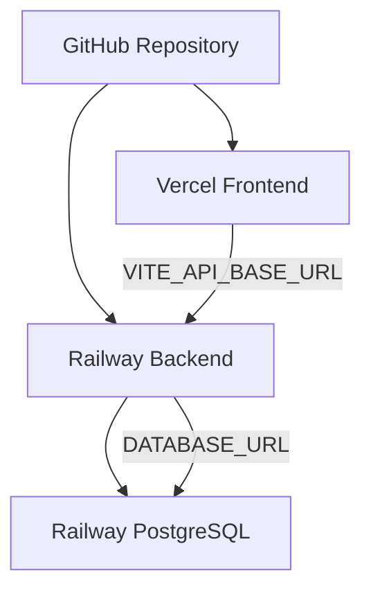

# Deployment

TodoTree は Frontend を Vercel、Backend と PostgreSQL を Railway にデプロイする想定です。

## Deployment Architecture



## Frontend: Vercel

Vercel project root:

```text
frontend
```

Build command:

```bash
npm run build
```

Output directory:

```text
dist
```

Environment variables:

```text
VITE_API_BASE_URL=https://<your-railway-api>.railway.app
```

SPA routing:

- `frontend/vercel.json` rewrites all paths to `/index.html`

## Backend: Railway

Railway service root:

```text
backend
```

Procfile:

```text
web: uvicorn app.main:app --host 0.0.0.0 --port $PORT
```

Environment variables:

```text
DATABASE_URL=<Railway PostgreSQL DATABASE_URL>
SECRET_KEY=<strong-random-secret>
FRONTEND_ORIGIN=https://<your-vercel-app>.vercel.app
APP_ENV=production
```

Optional:

```text
SQL_ECHO=false
CREATE_TABLES_ON_STARTUP=false
```

`DATABASE_URL` が `postgresql://` または `postgres://` の場合、アプリ側で `postgresql+asyncpg://` に正規化します。

## Migration

Railway backend service に対して:

```bash
railway run alembic upgrade head
```

本番DB変更は Alembic migration で管理します。production では自動テーブル作成を使いません。

## Production Notes

- `SECRET_KEY` は production で必須
- `FRONTEND_ORIGIN` は Vercel のURLに合わせる
- `VITE_API_BASE_URL` は Railway backend URLに合わせる
- APIレスポンスは `Cache-Control: no-store`
- DB migration 後に基本フローを確認する

## Basic Smoke Test

- `GET /api/health`
- register
- login
- create project
- invite user
- invited user accepts invitation from `/projects`
