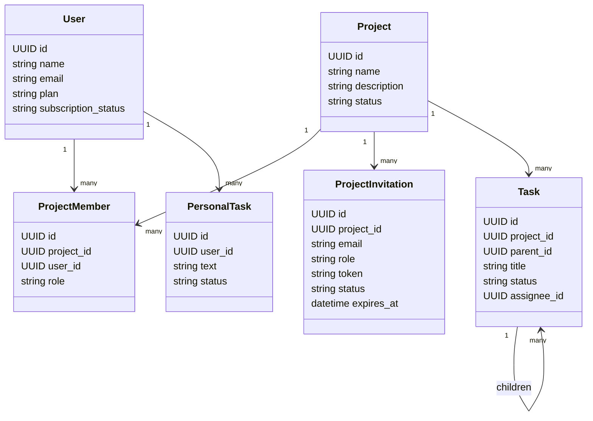

# Domain Model

このページは SQLAlchemy models と routers から確認できる概念だけをまとめます。

## Concepts

### User

認証ユーザーです。メールアドレスは一意です。plan / subscription 関連の列がありますが、課金処理は未実装です。

### Project

タスクをまとめる単位です。作成者は `ProjectMember` として owner になります。同名プロジェクトは別IDで作成できます。

### ProjectMember

User と Project の所属関係です。role は `owner`, `admin`, `member` がコード上で使われています。

### ProjectInvitation

プロジェクトへの招待です。メールアドレス、role、token、status、有効期限を持ちます。招待されたメールアドレスのユーザーが承認すると `ProjectMember` が作られます。

### Task

プロジェクトに属するタスクです。`parent_id` により自己参照し、階層タスクを表現します。

### PersonalTask

ユーザー個人のタスクです。プロジェクトには属しません。

## Domain Diagram

## Hierarchical Tasks

`Task.parent_id` が `tasks.id` を参照します。`parent_id IS NULL` のタスクがルートタスクです。APIでは `selectinload(Task.children).selectinload(Task.children)` により、現在は主に2階層先まで読み込む実装です。

未確定:

- UI/仕様として最大階層数を制限するかどうか
- タスク依存関係をDBで正式に管理するかどうか
